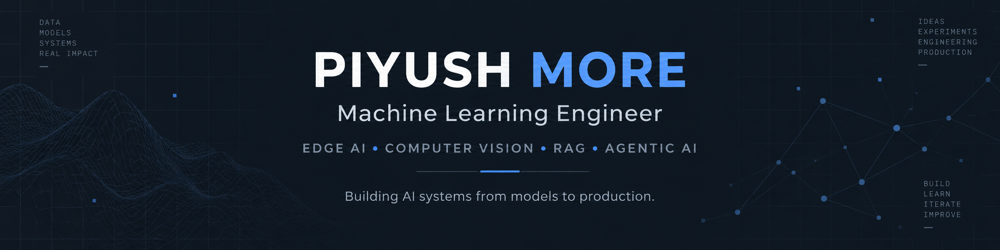

  

<h1 align="center">Piyush More</h1>

<h3 align="center">
Machine Learning Engineer
</h3>

Edge AI • Computer Vision • RAG • Agentic AI

Building production-oriented AI systems from model development and edge deployment
to retrieval pipelines and autonomous agent workflows.

  <a href="https://www.linkedin.com/in/piyushm9034/">LinkedIn</a>
  •
  <a href="mailto:piyush9034more@gmail.com">Email</a>

---

## 👨‍💻 About

I'm a **Machine Learning Engineer at SHG Technologies**, building production AI systems for Smart Vision Glasses - an assistive AI platform running intelligent features directly on mobile edge hardware.

My work spans the complete machine learning lifecycle:

**Data → Training → Evaluation → Optimization → Deployment → Benchmarking**

I have worked across **computer vision, edge ML, model optimization, OCR-assisted pipelines, ML evaluation tooling, RAG systems, and Agentic AI workflows**.

Alongside production ML, I am currently going deeper into building reliable **GenAI and Agentic AI systems** using LangGraph, LangChain, RAG, vector databases, tool-using agents, and multi-agent orchestration.

---

## 🚀 Featured Engineering Projects

| Project                             | Engineering Focus                                               | Core Stack                         |
| ---------------------               | --------------------------------------------------------------- | -----------------------------      |
| **SnP-Image-Labeler**               | ML dataset annotation, segregation and ground-truth tooling     | Python, PyQt5                      |
| **Edge Vision AI**                  | Object detection, classification and optimized edge inference   | YOLO, TensorFlow Lite, OpenCV      |
| **AutoCode Agent**                  | Multi-agent code generation, execution and iterative correction | Python, AutoGen, Docker            |
| **Multilingual Recipe Blog Writer** | LangGraph-based multilingual LLM workflow orchestration         | LangGraph, LangChain, Groq         |
| **Rice Grain Classification**       | Deep-learning model comparison for image classification         | TensorFlow, Keras, Computer Vision |

---

## ⚙️ What I Work On

### Machine Learning & Edge AI

* Model training, evaluation and error analysis
* Dataset curation and preprocessing
* Quantization and edge optimization
* Mobile inference pipelines
* Accuracy and latency benchmarking
* Production-oriented model deployment

### Computer Vision

* Object detection
* Image classification
* OCR-assisted pipelines
* Real-time vision systems
* YOLO-based workflows
* TensorFlow Lite / LiteRT deployment

### Generative AI & RAG

* Document ingestion
* Chunking and metadata design
* Embeddings
* Vector search
* Retrieval
* Re-ranking
* Grounded generation
* RAG evaluation

### Agentic AI

* LangGraph workflows
* Multi-agent systems
* Tool calling
* Planner–executor architectures
* Evaluation and feedback loops
* State and memory
* Human-in-the-loop systems

---

## 🧰 Technology Stack

### Core

`Python` `SQL`

### Machine Learning & Vision

`TensorFlow` `Keras` `YOLO` `OpenCV` `Scikit-learn` `TensorFlow Lite`

### Generative & Agentic AI

`LangGraph` `LangChain` `AutoGen` `RAG` `OpenAI API` `Groq`

### Retrieval

`Qdrant` `Pinecone` `Weaviate`

### Application Development

`FastAPI` `Streamlit` `PyQt5`

### Engineering

`Git` `GitHub` `Docker` `Prompt Engineering` `Context Engineering`

---

## 🏗️ Production Engineering Experience

At SHG Technologies, I work on production ML systems powering Smart Vision Glasses.

Some areas I have contributed to:

* Developed and shipped **10+ ML models and AI-powered features**
* Built lightweight inference pipelines running directly on mobile edge hardware
* Optimized models for **sub-100 ms on-device inference**
* Reduced dependency on cloud inference across multiple ML pipelines
* Improved model performance through dataset curation and architecture tuning
* Built internal ML tooling for structured model evaluation and benchmarking
* Prototyped Agentic AI features using LangGraph and LangChain

---

## 🛠️ ML Tooling

### SnP Image Labeler

A desktop annotation and benchmarking application built using **Python + PyQt5**.

Key capabilities:

* Bounding-box annotation
* Configurable telemetry fields
* CSV and JSON export
* Crash-safe writes
* Image caching
* Keyboard-driven workflows
* Thumbnail queue navigation
* Image Segregation
* Data Splitting in structured format

The tool supports structured ground-truth generation and validation across **10+ ML feature pipelines**.

---

  <b>Build. Evaluate. Improve. Ship.</b>

